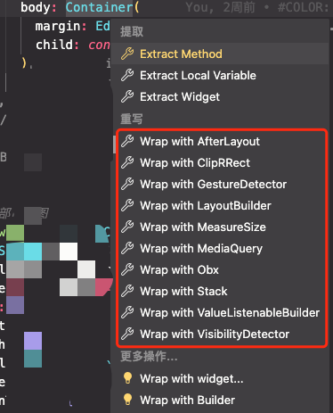
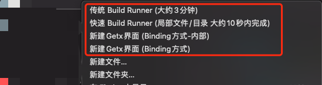
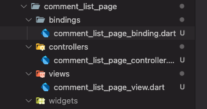
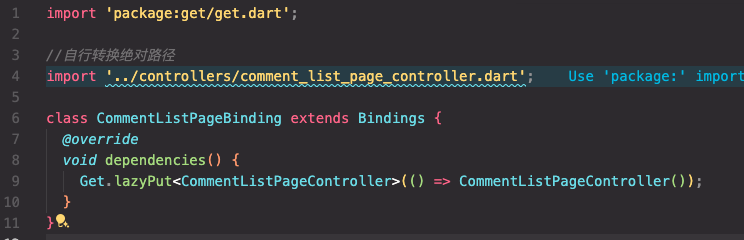
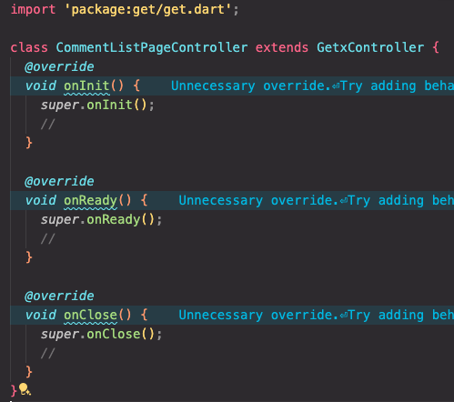
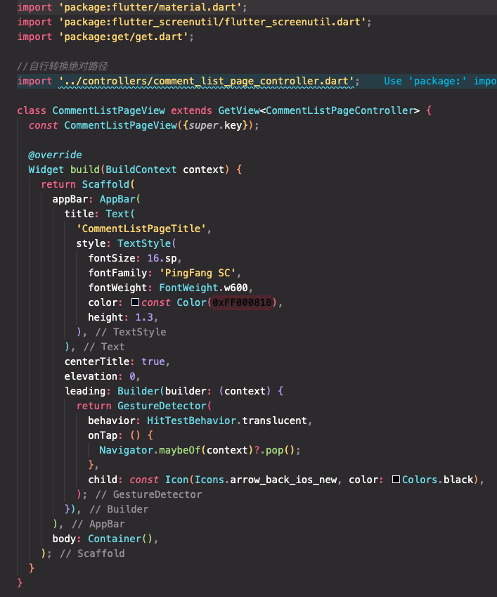
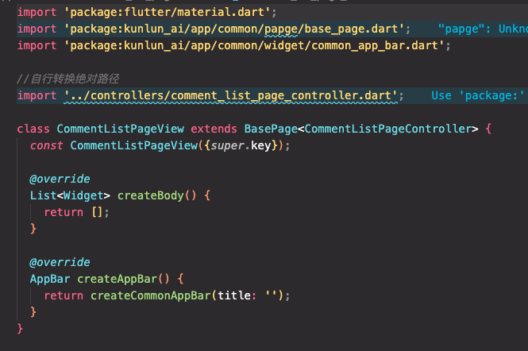

# Flutter Plugins

Flutter Plugins 是一个 VS Code 扩展，封装一些常用的基础功能，提高开发效率。

## 包裹功能

- 拓展用于快速包裹选中的 Flutter widget 的常用组件。

## 使用方法

1. 选中想要包裹的 widget，然后按下 `提取列表` 快捷键，选择 `拓展的组件` 即可。
2. 目前支持的组件有：
    - `LayoutBuilder`
    - `Obx`
    - `GestureDetector`
    - `ValueListenableBuilder`
    - `MediaQuery`
    - `AfterLayout`
    - `MeasureSize`
    - `VisibilityDetector`
    - `ClipRRect`
    - `Stack`

## 快捷键功能

- 拓展在工程项目右键增加快捷命令。

## 使用方法

1. 右键工程项目，选择 `快捷命令` 即可。
2. 目前支持的命令有：
    - `Quick Build Runner` (适用于局部文件/目录快速生成Model、repository) 
    - `Run Build Runner` (适用于全量生成Model、repository、图片资源)
    - `新建Getx界面 (Binding方式-内部)` (快速新建内部基类页面 - 限于目录右键)
    - `新建Getx界面 (Binding方式)` (快速新建页面 - 限于目录右键)

## 贡献

如果对你有帮助，欢迎 star。

此项目一直在更新，如果想新增功能，欢迎提交 issues 和 pull requests 到 [GitHub 仓库](https://github.com/ke112/vscode_plugins)。

## 联系
wechat : zhang1102d

## 更新日志

- 2024-09-10 更新了新建界面的命令支持。
- 2024-09-09 更新了快捷生成命令支持。
- 2024-09-06 更新了8个包裹组件支持。
  
## 许可

本项目采用 [MIT 许可证](LICENSE)。
